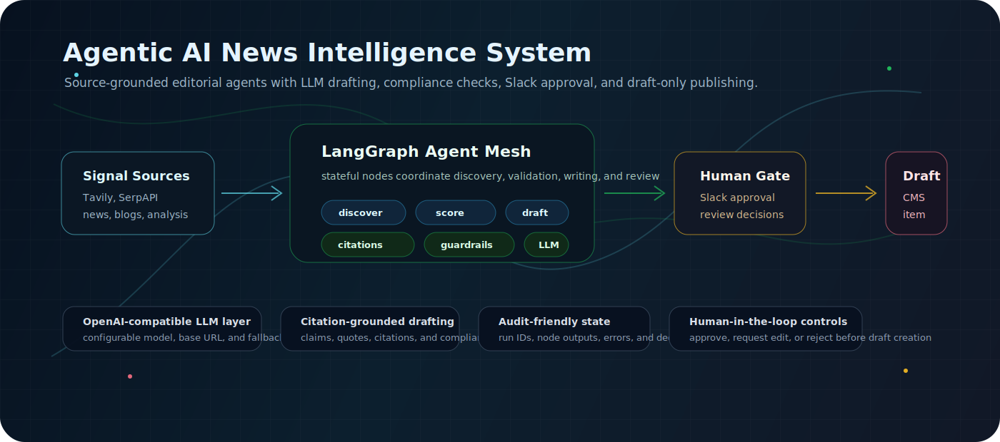
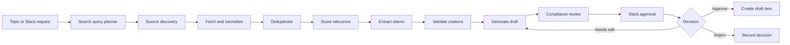
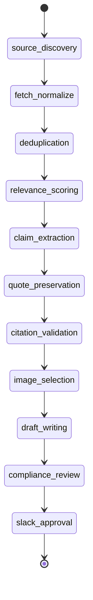
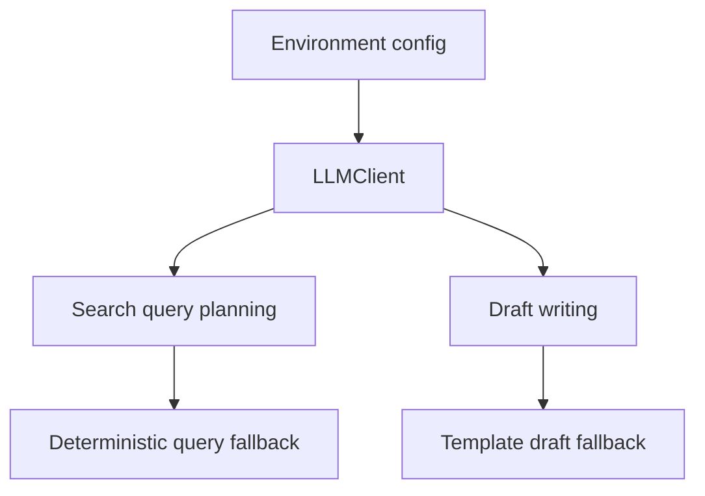
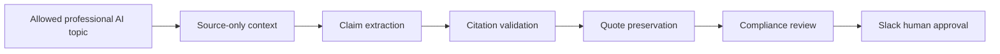

<div align="center">



# Agentic AI News Intelligence System

**A source-grounded, human-in-the-loop editorial intelligence pipeline for AI news, governance, compliance, startups, and enterprise technology analysis.**


</div>

---

## System Snapshot

| Layer | Stack |
| --- | --- |
| API | FastAPI, Pydantic v2 |
| Agent runtime | LangGraph `StateGraph` |
| LLM interface | OpenAI-compatible chat completions |
| Search intelligence | Tavily, SerpAPI, LLM query planning |
| Persistence | SQLAlchemy 2.x, configurable `DATABASE_URL` |
| Human review | Slack commands, events, interactive approval actions |
| Draft destination | Draft-only CMS integration layer |
| Quality controls | Guardrails, citation validation, quote preservation, compliance review |
| Tests and linting | pytest, pytest-asyncio, Ruff |

## What It Does

This system turns a professional AI-news topic into a reviewed editorial draft.



The architecture is deliberately conservative: the LLM assists with query planning and drafting, but source discovery, state transitions, validation, approvals, and persistence are handled by explicit application code.

## Agentic Architecture

The pipeline is implemented in `app/graphs/news_graph.py` with shared graph state in `app/graphs/news_state.py`.



Each node is an agent module under `app/agents/`. Nodes read and write the shared `NewsPipelineState`, attach structured outputs, and preserve errors or audit events for later inspection.

## Agent Matrix

| Agent | Responsibility | Primary output |
| --- | --- | --- |
| `source_discovery` | Plans and runs searches across configured providers | Candidate source URLs |
| `fetch_normalize` | Fetches source pages and normalizes metadata/content | Normalized articles |
| `deduplication` | Removes repeated or already-seen source material | Deduped article list |
| `relevance_scoring` | Scores candidates against the requested topic | Selected candidates |
| `claim_extraction` | Extracts factual claims needing evidence | Claim set |
| `quote_preservation` | Preserves direct quotes separately | Quote set |
| `citation_validation` | Maps claims and draft evidence to sources | Citation set |
| `image_selection` | Suggests relevant image candidates | Image candidates |
| `draft_writing` | Generates the editorial draft | Technical blog draft |
| `compliance_review` | Checks draft integrity and safety | Compliance report |
| `slack_approval` | Routes draft to human reviewers | Approval message metadata |
| `webflow_publisher` | Creates an approved draft item | Draft item metadata |
| `audit_logger` | Records major workflow events | Audit event trail |

## LLM Layer

LLM calls are routed through `app/integrations/llm_client.py`, a small OpenAI-compatible chat completions client.



Configurable model settings:

| Variable | Purpose |
| --- | --- |
| `LLM_ENABLED` | Enables LLM-backed query planning and draft generation |
| `LLM_API_KEY` or `OPENAI_API_KEY` | API key for chat completions |
| `LLM_BASE_URL` | OpenAI-compatible API base URL |
| `LLM_MODEL` | Chat model name, default `gpt-4o-mini` |
| `LLM_TIMEOUT_SECONDS` | Request timeout for model calls |

The LLM is used in two focused places:

1. `app/services/search_query_planner.py` converts a user topic into strict JSON search queries.
2. `app/agents/draft_writing.py` generates a LinkedIn-style professional draft from selected source context.

When LLM mode is disabled or unavailable, both paths fall back to deterministic behavior so the pipeline can still complete.

## Editorial Control Plane



Guardrails include:

- Professional AI-news topic filtering
- Rejection of unsafe or unrelated requests
- Source-only drafting instructions
- No invented facts, numbers, claims, or quotes
- Direct quote preservation
- Citation validation before approval routing
- Compliance review before a human approval decision

## Human-In-The-Loop Review

Slack is the operational review surface.

Supported interactions:

- Slash commands for topic management and news fetches
- App mentions with natural language requests
- Interactive approval actions: approve, needs edit, reject
- Slack request signature verification
- Processing locks to avoid duplicate in-flight requests from the same user/channel
- Persisted decisions tied to run, article, reviewer, channel, and message metadata

## API Surface

FastAPI routers are registered in `app/main.py`.

| Route | Purpose |
| --- | --- |
| `GET /health` | Health check |
| `POST /jobs/run-news-pipeline` | Runs the news pipeline for a topic |
| `POST /webhooks/slack/actions` | Receives Slack interactive actions |
| `POST /webhooks/slack/commands` | Receives Slack slash commands |
| `POST /webhooks/slack/events` | Receives Slack app events |
| `/articles/*` | Article and draft inspection routes |
| `/webflow/*` | Draft destination routes |

Example pipeline request:

```json
{
  "topic": "AI startup funding",
  "time_window_hours": 24,
  "max_stories": 10,
  "skip_duplicate_check": true
}
```

## Configuration

```text
DATABASE_URL=
REDIS_URL=

LLM_ENABLED=false
LLM_API_KEY=
OPENAI_API_KEY=
LLM_BASE_URL=https://api.openai.com/v1
LLM_MODEL=gpt-4o-mini
LLM_TIMEOUT_SECONDS=60

SERPAPI_API_KEY=
TAVILY_API_KEY=

SLACK_BOT_TOKEN=
SLACK_SIGNING_SECRET=
SLACK_APPROVAL_CHANNEL_ID=

WEBFLOW_API_TOKEN=
WEBFLOW_SITE_ID=
WEBFLOW_COLLECTION_ID=

DEFAULT_TIME_WINDOW_HOURS=24
MAX_STORIES_PER_RUN=10
MIN_RELEVANCE_SCORE=0.72
SCHEDULER_ENABLED=false
```

## Local Development

Install dependencies:

```bash
uv sync
```

Run the API:

```bash
uv run uvicorn app.main:app --reload
```

Run tests:

```bash
uv run pytest
```

Run linting:

```bash
uv run ruff check .
```

## Repository Layout

```text
app/
  agents/          LangGraph node implementations
  api/             FastAPI routers
  graphs/          LangGraph graph and state definition
  integrations/    External service clients
  services/        Shared domain services and guardrails
  config.py        Environment-backed settings
  db.py            Database setup/session helpers
  models.py        SQLAlchemy models
  repositories.py  Persistence operations
docs/assets/       README graphics
tests/             Unit and smoke tests
```
